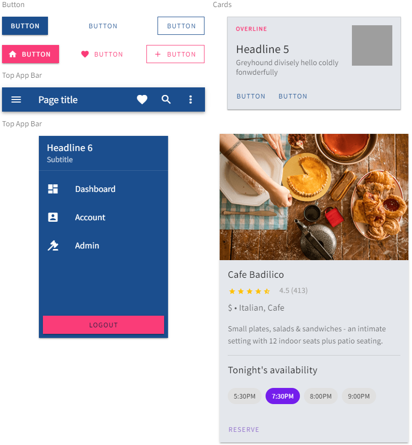

<!-- SPDX-License-Identifier: MIT --->
<!-- © Daimler TSS GmbH --->


[](LICENSE)


Product Kit for Vue provides components for Daimler TSS web frontends based on the material design framework Vuetify.

Feel free to open an [issue](https://github.com/mercedes-benz/product-kit_vue/issues) or provide a pull request with the desired modifications.

## Examples



## Installation

*Note that you must have node (with npm) and vue.js installed.*

Create a new vue.js project using vue CLI and add Vuetify
```console
vue create my-app
cd my-app
vue add vuetify
```

Install the npm package from the root directory through:
```console
npm install @daimler/productkit-vue
```

Include the following line in the `src/plugins/vuetify.js` file:
```javascript
import colors from '@daimler/productkit-vue/src/theme/colors.js';
```

Add the imported preset in the existing `export` statement as
```javascript
export default new Vuetify({
    preset: colors
});
```
Lastly, copy and paste the following block in the `module.exports` object in `vue.config.js`:
```javascript
css: {
    loaderOptions: {
      scss: { // 9.0.0
        additionalData: `
          @use "@daimler/productkit-core/exports/web/styles/scss/variables" as tokens;
          @use "@daimler/productkit-core/exports/web/styles/scss/variables-dark" as tokensDark;
          @import "@daimler/productkit-vue/src/theme/variables.scss";
          @import "@daimler/productkit-vue/src/theme/overrides.scss";
        `,
      },
      sass: { // 9.0.0
        additionalData: `
          @use "@daimler/productkit-core/exports/web/styles/scss/variables" as tokens
          @use "@daimler/productkit-core/exports/web/styles/scss/variables-dark" as tokensDark
          @import "@daimler/productkit-vue/src/theme/variables.scss"
          @import "@daimler/productkit-vue/src/theme/overrides.scss"
        `,
      },
    },
  },
```

Your Vuetify components should now be styled accordingly to the styleguide of Daimler TSS!

## Usage

### Colors
Product Kit Vue comes with all custom Daimler TSS colors like `primary` (corporate blue) or `secondary` (corporate pink) and their shades (`lighten-1` to `lighten 5` and `darken-1` to `darken-4`). It furthermore works with the standard Vuetify color palette, including colors like `green` or `blue-grey`. 

You can use the custom Daimler TSS colors in different ways:
- In the `color` attribute of supporting elements like `v-btn` or `v-sheet`
- Adding `class="primary"` to an element will change the background color of it. Adding for example `class="primary darken-3"` will apply a darker blue
- Font color is set automatically based on the background-color. If you want to use a specific font color you can do so by applying for example the `primary--text` class. Combined with the `text-lighten-1` class the text will appear slightly lighter
- In CSS you can use `var(--v-primary-base)` or `var(--v-primary-lighten1)`
```html
<v-btn
    color="primary"
    raised
    large
> Button </v-btn>

<v-btn
    color="secondary lighten-2"
    tile
> Button </v-btn>

<v-sheet
    color="secondary"
    style="border: 1px solid var(--v-secondary-darken4)"
    height="200px"
></v-sheet>

<span class="primary--text">Hello World!</span>
```
For further information on colors visit the [Vuetify Documentation](https://vuetifyjs.com/en/styles/colors/).

### Spacing
The standard way of applying spacing in Vuetify is adding for example `class="pa-4"` for padding or `class="ma-4"` for margin. With Product Kit Vue, you are now also able to use custom and responsive spacings for `padding` and `margin` by applying t-shirt sizes (`3xs`, `xxs`, `xs`, `s`, `m`, `l`, `xl`, `xxl`, `3xl`) instead of absolute numbers. The spacing will now be responsive regarding the width of the screen:
```html
<v-btn
    class="ma-xl"
> Button </v-btn>

<v-sheet
    class="pt-m"
    height="300px"
></v-sheet>
```

### Container
When building applications with Vuetify and Product Kit Vue, you should use `v-container` as a root container after `v-app` and `v-main`, as it includes responsive margins and max-widths.
```html
<v-app>
    <v-main>
        <v-container>
            ...
        </v-container>
    </v-main>
</v-app>
```
When you want to use `v-container` as a wrapper for other elements that should not have responsive margins and max-widths, you must either use the `fluid` attribute or use `div`:
```html
<v-container fluid>
    ...
</v-container>

<div>
    ...
</div>
```


## Contributing

We welcome any contributions.
If you want to contribute to this project, please read the [contributing guide](CONTRIBUTING.md).

## Code of Conduct

Please read our [Code of Conduct](https://github.com/Daimler/daimler-foss/blob/master/CODE_OF_CONDUCT.md) as it is our base for interaction.

## License

This project is licensed under the [MIT LICENSE](LICENSE).

## Provider Information

Please visit <https://www.daimler-tss.com/en/imprint/> for information on the provider.

Notice: Before you use the program in productive use, please take all necessary precautions,
e.g. testing and verifying the program with regard to your specific use.
The program was tested solely for our own use cases, which might differ from yours.
