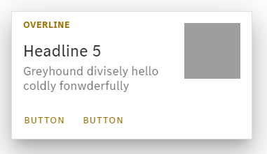
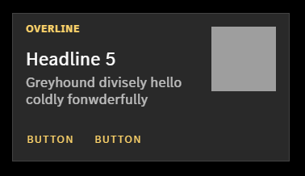

<!-- SPDX-License-Identifier: MIT --->


[](LICENSE)


Product Kit Vue provides a theme for Mercedes-Benz Tech Innovation web frontends based on the material design framework Vuetify.

Feel free to open an [issue](https://github.com/mercedes-benz/product-kit_vue/issues) or provide a pull request with the desired modifications.

## Examples

<p float="left">
  
   
  
  
</p>

## Installation

### Vue

Follow the guide on the offical [Vue documenation](https://vuejs.org/guide/quick-start.html#creating-a-vue-application) for creating a Vue application.

### Vuetify

Follow the officals [Vuetify documentation](https://vuetifyjs.com/en/getting-started/installation/#manual-steps) manual steps to add Vuetify to the appliaction.

Make sure to [install the material design icons](https://vuetifyjs.com/en/features/icon-fonts/#installing-icon-fonts) as well.

### Product Kit Vue

Install the npm package using following command:

```
npm install @mercedes-benz/productkit-vue
```

Create Vuetify using Product Kit, see following example:

```javascript
import { useProductKit } from '@mercedes-benz/productkit-vue';

const productKit = useProductKit();
const vuetify = createVuetify(productKit);
```

As Product Kit overrides component styles, Vuetify needs to load a custom config file. To use this, it is recommended installing the `vite-plugin-vuetify` and use following implementation in the `vite.config` file.

```javascript
import vuetify from 'vite-plugin-vuetify';

plugins: [
  vue(),
  vuetify({
    styles: {
      configFile: 'node_modules/@mercedes-benz/productkit-vue/src/styles/settings.scss',
    },
  }),
];
```

That's it!

Your Vuetify components should now be styled accordingly to the styleguide of Mercedes-Benz!

## Usage

### Container

When building applications with Vuetify and Product Kit Vue, use a `v-container` as a wrapper container after `v-app`, as it includes max-widths that limits the content-width on large screens. Set this main wrapper container to `fluid` for the capability to use full-width content.

```html
<v-app>
  <v-container fluid>
    <v-main>
      <router-view />
    </v-main>
  </v-container>
</v-app>
```

Now inside your `v-main` you should always use `v-container` as a wrapper for a content section. For full-width content use `fluid`.

### Colors

Product Kit Vue comes with custom application colors as `primary`, `secondary`, `info`, `warning`, etc. and base colors like `blue`, `red`, `green` with their according shades.

All [default colors prodived by Vuetify](https://vuetifyjs.com/en/styles/colors/) are also available.

### Spacing

With Product Kit Vue, you are able to use custom and responsive spacings for `padding` and `margin` by applying t-shirt sizes (`3xs`, `xxs`, `xs`, `s`, `m`, `l`, `xl`, `xxl`, `3xl`) instead of absolute numbers. The spacing will now be responsive regarding the width of the screen.

```html
<div class="ma-l px-m py-xxs">Foo</div>
```

### Typography

In order to use the proprietary Mercedes-Benz font, you have to download the web font and include it in your project.

```css
<style>
@font-face {
    font-family: "MB Corpo S Text Web";
    src: local("MB Corpo S Text Web"),
        url("<PATH_TO>/<NAME_OF_THE_FILE>.woff2") format("woff2");
}

@font-face {
    font-family: "MB Corpo A Title Cond Web";
    src: local("MB Corpo A Title Cond Web"),
        url("<PATH_TO>/<NAME_OF_THE_FILE>.woff2") format("woff2");
}
</style>
```

Be sure to not change the values for `font-family` and `src: local()`. Replace `<PATH_TO>/<NAME_OF_THE_FILE>` with the filename.

You can now use typography as you are used to from Vuetify. Custom Mercedes-Benz font and responsive tokens are applied automatically. For accessibility reasons it is recommended to always use the referring `html` tag to display a typography-class:

```html
<h1 class="text-h1">This is a headline 1</h1>

<p class="text-body-1">This is a paragraph</p>

<span class="text-overline">This is an overline an overline</span>
```

### Darkmode

Product Kit Vue 3 also supports a darkmode. Just follow the [Vuetify documentation](https://vuetifyjs.com/en/features/theme/#changing-theme) to implement a toggle theme button.

## Contributing

We welcome any contributions.
If you want to contribute to this project, please read the [contributing guide](CONTRIBUTING.md).

## Code of Conduct

Please read our [Code of Conduct](https://github.com/mercedes-benz/foss/blob/master/CODE_OF_CONDUCT.md) as it is our base for interaction.

## License

This project is licensed under the [MIT LICENSE](LICENSE).

## Provider Information

Please visit <https://www.mercedes-benz-techinnovation.com/en/imprint/> for information on the provider.

Notice: Before you use the program in productive use, please take all necessary precautions,
e.g. testing and verifying the program with regard to your specific use.
The program was tested solely for our own use cases, which might differ from yours.
